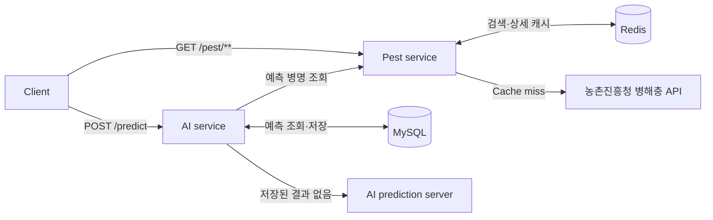

# Plant Disease Detection API


작물 병해 이미지를 AI 서버에 전달해 질병을 예측하고, 예측 결과를 농촌진흥청 병해충 정보와 연결해 제공하는 Spring Boot 백엔드입니다.

AI 예측 결과는 MySQL에 저장하여 같은 이미지와 작물 조합의 중복 요청을 줄이고, 병해충 검색 및 상세 조회 결과는 Redis에 캐시합니다.

## 주요 기능

| 기능 | 설명 |
| --- | --- |
| 병해충 검색 | 작물명 또는 병명으로 검색하며, 한 페이지에 5개씩 반환합니다. |
| 병해충 상세 조회 | 감염 경로, 발생 조건, 증상, 예방·방제 방법과 관련 이미지를 제공합니다. |
| AI 이미지 예측 | 작물 종류와 잎 이미지를 AI 서버로 전송해 질병명과 신뢰도를 반환합니다. |
| 상세 정보 연결 | AI가 예측한 병명을 병해충 API에서 검색해 상세 정보를 결합합니다. |
| 예측 결과 재사용 | 이미지 SHA-256 해시와 요청 작물을 기준으로 기존 MySQL 결과를 재사용합니다. |
| 응답 캐시 | 검색 결과는 30분, 상세 정보는 1시간 동안 Redis에 캐시합니다. |
| 공통 예외 처리 | 입력 오류, 파일 용량 초과, 외부 API 오류와 타임아웃을 동일한 형식으로 반환합니다. |

## 요청 처리 흐름



`POST /predict` 요청은 업로드 이미지의 해시를 먼저 계산합니다. 동일한 이미지와 작물로 저장된 결과가 있으면 AI 서버를 다시 호출하지 않습니다.

## 기술 스택

- Java 21
- Spring Boot 4.1.0
- Spring Web MVC, WebFlux `WebClient`
- Spring Data JPA, MySQL
- Flyway
- Spring Cache, Redis
- Bean Validation
- Gradle Wrapper

## 실행 전 준비

- JDK 21
- MySQL
- Redis
- 농촌진흥청 병해충 API 인증 키
- `POST /predict`를 제공하는 AI 예측 서버

기본 연결 정보는 다음과 같습니다.

| 대상 | 기본값 |
| --- | --- |
| 애플리케이션 | `http://localhost:8080` |
| AI 서버 | `http://localhost:5000` |
| MySQL | `localhost:3306/plant_disease` |
| Redis | `localhost:6379` |

## 환경 설정

설정 원본은 [`src/main/resources/application.properties`](src/main/resources/application.properties)에 있습니다.

| 환경 변수 | 필수 | 기본값 | 설명 |
| --- | :---: | --- | --- |
| `PEST_API_KEY` | O | - | 농촌진흥청 병해충 API 인증 키 |
| `MYSQL_PASSWORD` | O | - | MySQL 비밀번호 |
| `MYSQL_URL` | X | `jdbc:mysql://localhost:3306/plant_disease?...` | JDBC 연결 URL |
| `MYSQL_USERNAME` | X | `plant_app` | MySQL 사용자 이름 |
| `AI_API_URL` | X | `http://localhost:5000` | AI 서버 기본 URL |
| `SPRING_DATA_REDIS_HOST` | X | `localhost` | Redis 호스트 |
| `SPRING_DATA_REDIS_PORT` | X | `6379` | Redis 포트 |

PowerShell 설정 예시:

```powershell
$env:PEST_API_KEY = "발급받은_API_키"
$env:MYSQL_PASSWORD = "MySQL_비밀번호"
$env:MYSQL_USERNAME = "plant_app"
$env:AI_API_URL = "http://localhost:5000"
```

MySQL 사용자에게 데이터베이스 생성 및 스키마 변경 권한이 있어야 합니다. 애플리케이션 시작 시 Flyway가 `src/main/resources/db/migration`의 마이그레이션을 실행하며, JPA는 결과 스키마를 검증합니다.

## 실행 방법

MySQL, Redis, AI 서버를 먼저 실행한 뒤 아래 명령을 사용합니다.

### Windows

```powershell
.\gradlew.bat bootRun
```

### macOS / Linux

```bash
./gradlew bootRun
```

서버는 기본적으로 `http://localhost:8080`에서 실행됩니다.

## API

### API 요약

| Method | Endpoint | 설명 |
| --- | --- | --- |
| `GET` | `/pest` | 병해충 검색 |
| `GET` | `/pest/{sickKey}` | 병해충 상세 조회 |
| `POST` | `/predict` | 이미지 기반 병해 예측 |

### 병해충 검색

```http
GET /pest?cropName={cropName}&sickNameKor={sickNameKor}&page={page}
```

| 파라미터 | 필수 | 기본값 | 설명 |
| --- | :---: | --- | --- |
| `cropName` | 조건부 | - | 작물명. `sickNameKor`가 없으면 필수 |
| `sickNameKor` | 조건부 | - | 병명. `cropName`이 없으면 필수 |
| `page` | X | `1` | 1 이상의 페이지 번호 |

```powershell
curl.exe "http://localhost:8080/pest?cropName=사과&page=1"
```

응답 예시:

```json
{
  "totalCount": 12,
  "page": 1,
  "displayCount": 5,
  "totalPages": 3,
  "items": [
    {
      "cropName": "사과",
      "thumbImg": "https://example.com/image.jpg",
      "sickNameKor": "갈색무늬병",
      "sickKey": "SICK_KEY"
    }
  ]
}
```

### 병해충 상세 조회

```http
GET /pest/{sickKey}
```

```powershell
curl.exe "http://localhost:8080/pest/SICK_KEY"
```

응답에는 다음 정보가 포함됩니다.

- 작물명과 병명의 한글·한자·영문 표기
- 감염 경로와 발생 조건
- 증상 및 예방 방법
- 생물적·화학적 방제 방법
- 관련 이미지 목록

### AI 이미지 예측

```http
POST /predict
Content-Type: multipart/form-data
```

| 필드 | 타입 | 필수 | 설명 |
| --- | --- | :---: | --- |
| `cropName` | String | O | 지원 작물의 영문 식별자 |
| `image` | File | O | `image/*` 형식의 이미지, 최대 20MB |

지원 작물:

| 요청 값 | 작물명 |
| --- | --- |
| `potato` | 감자 |
| `apple` | 사과 |
| `grape` | 포도 |
| `peach` | 복숭아 |
| `strawberry` | 딸기 |

```powershell
curl.exe -X POST "http://localhost:8080/predict" `
  -F "cropName=apple" `
  -F "image=@C:\images\apple-leaf.jpg"
```

응답 예시:

```json
{
  "status": "SUCCESS",
  "cropName": "apple",
  "sickNameKor": "갈색무늬병",
  "confidence": 99.0,
  "message": "예측에 성공했습니다.",
  "pestInfo": {
    "cropName": "사과",
    "sickNameKor": "갈색무늬병",
    "symptoms": "...",
    "preventionMethod": "...",
    "imageList": []
  }
}
```

#### 예측 상태

| `status` | 의미 | `pestInfo` |
| --- | --- | --- |
| `SUCCESS` | 예측 결과와 일치하는 병해충 상세 정보를 찾았습니다. | 상세 객체 |
| `UNDETERMINED` | AI가 이미지를 판별하기 어렵다고 응답했습니다. | `null` |
| `INFO_NOT_FOUND` | 질병은 예측했지만 연결할 상세 정보가 없습니다. | `null` |

## 외부 AI 서버 규격

백엔드는 `${AI_API_URL}/predict`로 다음 요청을 전달합니다.

| 필드 | 타입 | 설명 |
| --- | --- | --- |
| `crop_name` | String | 영문 작물 식별자 |
| `image` | File | 업로드 이미지 |

AI 서버 응답 형식:

```json
{
  "crop_name": "apple",
  "sick_name_kor": "갈색무늬병",
  "confidence": 99.0
}
```

판단하기 어려운 이미지라면 `sick_name_kor`에 `판단보류`를 반환합니다. AI 서버 요청 제한 시간은 15초입니다.

## 데이터 저장 및 캐시

| 저장소 | 대상 | 식별 기준 | 정책 |
| --- | --- | --- | --- |
| MySQL `ai_results` | AI 예측 결과 | 이미지 SHA-256 해시 + 요청 작물 | 영구 저장 및 중복 예측 방지 |
| Redis `pestSearch` | 병해충 검색 결과 | `cropName:sickNameKor:page` | 30분 |
| Redis `pestInfo` | 병해충 상세 정보 | `sickKey` | 1시간 |

병해충 외부 API 요청 제한 시간은 5초입니다.

## 오류 응답

모든 예외 응답은 동일한 구조를 사용합니다.

```json
{
  "status": 400,
  "code": "BAD_REQUEST",
  "message": "작물명 또는 병명 중 하나는 입력해야 합니다.",
  "timestamp": "2026-06-29 12:00:00"
}
```

| HTTP 상태 | 코드 | 발생 상황 |
| --- | --- | --- |
| `400` | `BAD_REQUEST` | 잘못된 입력, 지원하지 않는 작물, 잘못된 파일 형식 |
| `413` | `FILE_TOO_LARGE` | 20MB를 초과한 파일 업로드 |
| `502` | `AI_SERVER_ERROR` | AI 서버 연결 또는 응답 처리 실패 |
| `502` | `PEST_API_ERROR` | 병해충 API 연결 또는 응답 처리 실패 |
| `502` | `EXTERNAL_API_ERROR` | 처리되지 않은 외부 API 호출 오류 |
| `504` | `AI_TIMEOUT` | AI 서버 응답 시간 초과 |
| `504` | `PEST_API_TIMEOUT` | 병해충 API 응답 시간 초과 |
| `504` | `EXTERNAL_API_TIMEOUT` | 처리되지 않은 외부 API 타임아웃 |
| `500` | `INTERNAL_SERVER_ERROR` | 처리되지 않은 서버 오류 |

## 프로젝트 구조

```text
src/main
├── java/com/jihyoung/plant_disease_detection_web_spring
│   ├── ai
│   │   ├── client          # AI 서버 통신
│   │   ├── controller      # 이미지 예측 API
│   │   ├── dto             # AI 요청·응답 모델
│   │   ├── entity          # AI 예측 결과 엔티티
│   │   ├── repository      # 예측 결과 조회·저장
│   │   └── service         # 검증, 예측, 결과 재사용 및 상세 정보 연결
│   ├── pest
│   │   ├── cache           # Redis 캐시 설정
│   │   ├── client          # 농촌진흥청 API 통신
│   │   ├── controller      # 병해충 검색·상세 API
│   │   ├── dto             # 검색·상세 응답 모델
│   │   └── service         # 검색, 페이징 및 상세 조회
│   ├── global
│   │   ├── dto             # 공통 오류 응답
│   │   └── exception       # 외부 API 예외 및 전역 예외 처리
│   └── user                # 사용자 엔티티와 저장소
└── resources
    ├── application.properties
    └── db/migration        # Flyway 마이그레이션
```

## 테스트

```powershell
.\gradlew.bat test
```

---

병해충 정보 출처: 농촌진흥청 국가농작물병해충관리시스템
